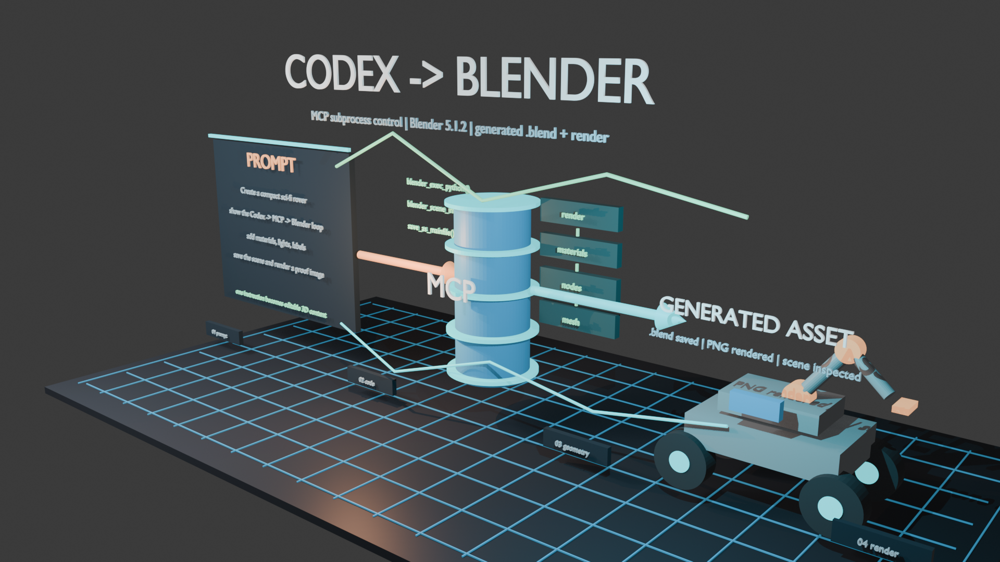
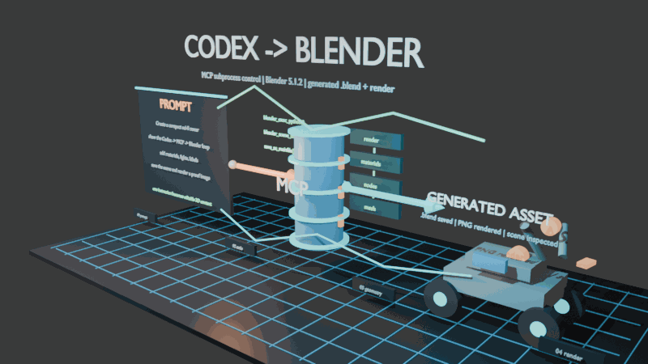

# Codex Blender MCP Demo

An open, reproducible demo showing Codex controlling Blender through
`hassledzebra/codex_blender_mcp`.

The project generates a technical concept scene in Blender, saves an editable
`.blend` file, renders a hero image, adds visible keyframe animation, and
exports a GIF preview.





## What This Demonstrates

- Codex can call a Blender MCP tool chain from Python.
- Blender can be driven in background `subprocess` mode.
- A single script can create geometry, materials, lights, labels, camera setup,
  keyframes, `.blend` output, and rendered media.
- The generated scene can be inspected again through `blender_scene_info`.

This is a compact example of the "automatic scene building" workflow: give
Codex a scene brief, then let it assemble a concept scene, technical diagram, or
interaction prototype in Blender.

## Outputs

- `outputs/codex_blender_case/codex_blender_mcp_case.blend`
- `outputs/codex_blender_case/codex_blender_mcp_case_animated.blend`
- `outputs/codex_blender_case/codex_blender_mcp_case.png`
- `outputs/codex_blender_case/codex_blender_mcp_case_animation.gif`
- `outputs/codex_blender_case/x_article_codex_blender_direct_control.md`

## Requirements

- Windows, macOS, or Linux
- Blender 5.1 or newer recommended
- Python 3.10+
- Git

The demo was created and verified with Blender 5.1.2 on Windows.

## Quick Start

```powershell
python -m venv .venv
.\.venv\Scripts\python.exe -m pip install -r requirements.txt
$env:BLENDER_PATH = "C:\Program Files\Blender Foundation\Blender 5.1\blender.exe"
.\.venv\Scripts\python.exe .\tools\run_codex_blender_case.py
.\.venv\Scripts\python.exe .\tools\render_codex_blender_animation.py
```

If Blender is already on your `PATH`, you can omit `BLENDER_PATH` after adapting
the scripts or setting it to `blender`.

## Scripts

- `tools/run_codex_blender_case.py` creates the main scene, saves the `.blend`,
  renders the hero PNG, and writes a scene summary.
- `tools/render_codex_blender_animation.py` opens the generated `.blend`, adds
  clearer keyframes, renders a PNG frame sequence, and compiles a GIF preview.

## Safety Note

MCP-driven Blender workflows execute generated Python code in Blender. Run demos
in a clean project directory or virtual machine if you are testing untrusted
prompts or third-party scripts.

## Credits

- Blender: https://www.blender.org/
- Blender MCP reference: https://www.blender.org/lab/mcp-server/
- Codex Blender MCP: https://github.com/hassledzebra/codex_blender_mcp

## License

MIT
