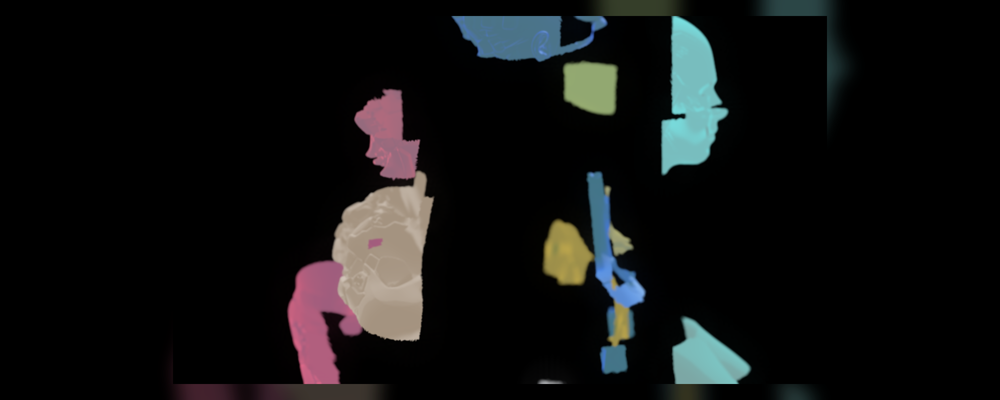

# Codex Blender MCP Demo



An open, reproducible set of Codex + Blender demos showing how Codex can drive
Blender through Python and MCP-style tool execution.

The project now contains two showcase workflows:

- **Automatic scene building**: Codex creates a complete technical concept
  scene from scratch, including geometry, materials, lights, camera, labels,
  `.blend` output, a hero render, and a GIF preview.
- **Existing asset decomposition**: Codex opens a Blender scene from
  [`nidorx/matcaps`](https://github.com/nidorx/matcaps), isolates the female
  sci-fi bust, identifies that the largest `component_001` is still a
  continuous mesh, segments it into 12 semantic modules, and keyframes a clean
  disassembly / reassembly animation.

## Demo 1: Codex -> MCP -> Blender

This compact demo uses `hassledzebra/codex_blender_mcp` in background
`subprocess` mode. It generates a stylized technical workbench scene that
visualizes a Codex-to-Blender control loop.


What it demonstrates:

- Codex can call a Blender MCP tool chain from Python.
- Blender can be driven in background `subprocess` mode.
- A single script can create geometry, materials, lights, labels, camera setup,
  keyframes, `.blend` output, and rendered media.
- The generated scene can be inspected again through `blender_scene_info`.

## Demo 2: MatCap Bust Semantic Assembly

This demo uses the repository imagery and preview bust from
[`nidorx/matcaps`](https://github.com/nidorx/matcaps). Instead of using generic
spheres, it works with the actual female sci-fi bust asset.

The first geometry pass finds 83 loose mesh components in
`PreviewSolideFemaleSCIFIbust`. The largest one, `component_001`, is still the
whole continuous upper-body bust, so Codex performs a second semantic split into
12 animatable modules:

- `cranial_shell`
- `face_mask`
- `jaw_neck_front`
- `rear_head_plate`
- `temple_ear_module`
- `neck_spine`
- `upper_chest_shell`
- `front_bust_pod`
- `side_rib_panel`
- `rear_torso_shell`
- `lower_base_block`
- `connector_transition`


What it demonstrates:

- Codex can inspect existing Blender geometry instead of only creating new
  primitives.
- Loose mesh components do not always match human-meaningful parts.
- A continuous mesh can be converted into semantic modules for explanation,
  visualization, or assembly-style animation.
- The final animation is rendered cleanly with only the sculpture and separated
  modules visible.

## Outputs

Core scene-building outputs:

- `outputs/codex_blender_case/codex_blender_mcp_case.blend`
- `outputs/codex_blender_case/codex_blender_mcp_case_animated.blend`
- `outputs/codex_blender_case/codex_blender_mcp_case.png`
- `outputs/codex_blender_case/codex_blender_mcp_case_animation.gif`
- `outputs/codex_blender_case/x_article_codex_blender_direct_control.md`

MatCap bust assembly outputs:

- `outputs/matcap_bust_component001_assembly/component001_semantic_assembly.blend`
- `outputs/matcap_bust_component001_assembly/component001_semantic_assembly_hero.png`
- `outputs/matcap_bust_component001_assembly/component001_semantic_assembly_animation.gif`
- `outputs/matcap_bust_component001_assembly/component001_semantic_assembly_summary.json`

Project thumbnail / cover:

- `docs/cover_5x2.png` (`2000 x 800`, 5:2)

## Requirements

- Windows, macOS, or Linux
- Blender 5.1 or newer recommended
- Python 3.10+
- Git

The demos were created and verified with Blender 5.1.2 on Windows.

## Quick Start

```powershell
python -m venv .venv
.\.venv\Scripts\python.exe -m pip install -r requirements.txt
$env:BLENDER_PATH = "C:\Program Files\Blender Foundation\Blender 5.1\blender.exe"
.\.venv\Scripts\python.exe .\tools\run_codex_blender_case.py
.\.venv\Scripts\python.exe .\tools\render_codex_blender_animation.py
```

If Blender is already on your `PATH`, you can omit `BLENDER_PATH` after adapting
the scripts or setting it to `blender`.

The MatCap bust demo expects the `nidorx/matcaps` `scene.blend` and PNG MatCap
assets to exist under `assets/`. The generated `.blend`, PNG, GIF, and JSON
outputs are included for reference.

## Scripts

- `tools/run_codex_blender_case.py` creates the first generated scene, saves the
  `.blend`, renders the hero PNG, and writes a scene summary.
- `tools/render_codex_blender_animation.py` opens the generated `.blend`, adds
  clearer keyframes, renders a PNG frame sequence, and compiles a GIF preview.
- `tools/export_bust_components.py` exports the 83 loose mesh components from
  the source bust as diagnostic images.
- `tools/preview_component001_semantic_segmentation.py` previews the 12-part
  semantic segmentation of the continuous `component_001` mesh.
- `tools/run_component001_semantic_assembly_demo.py` creates the final clean
  disassembly / reassembly animation.

## Safety Note

MCP-driven Blender workflows execute generated Python code in Blender. Run demos
in a clean project directory or virtual machine if you are testing untrusted
prompts or third-party scripts.

## Credits

- Blender: https://www.blender.org/
- Blender MCP reference: https://www.blender.org/lab/mcp-server/
- Codex Blender MCP: https://github.com/hassledzebra/codex_blender_mcp
- MatCap assets and preview scene: https://github.com/nidorx/matcaps

## License

MIT
